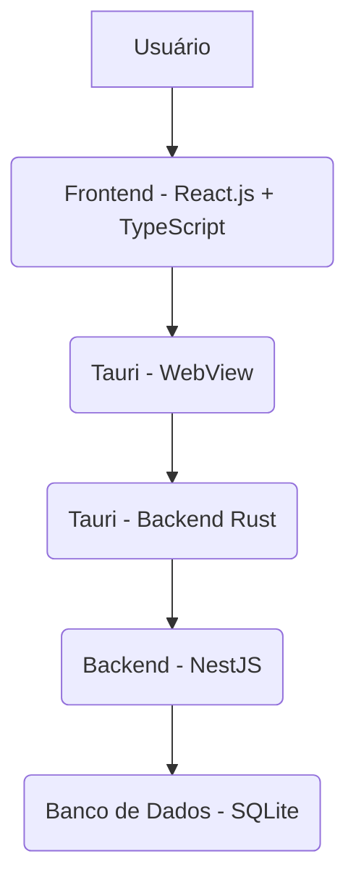

# OriFin: Gestão de Finanças Pessoais


## 🚀 Visão Geral do Projeto

**OriFin** (Origem das Finanças / Orientação Financeira) é um sistema de gestão de finanças pessoais projetado para ajudar indivíduos a monitorar e controlar suas despesas e receitas de forma eficiente. O objetivo é proporcionar uma visão clara da saúde financeira, permitindo que os usuários tomem decisões mais informadas sobre seus gastos e poupanças, com foco especial na gestão de despesas e cartões de crédito, tudo isso em um ambiente desktop offline-first.

## ✨ Funcionalidades Principais

- **Registro Detalhado de Despesas:** Registre despesas com valor, data da compra, data de vencimento, descrição e meio de pagamento (Cash, PIX, Cartão de Crédito, etc.).
- **Categorização Flexível:** Classifique suas despesas com categorias predefinidas ou personalize as suas próprias.
- **Dashboard Interativo:** Visualize rapidamente o status das suas finanças, com destaque para vencimentos próximos, montantes a pagar por categoria e por meio de pagamento.
- **Visualização em Tabela:** Uma tela completa para gerenciar todas as suas despesas, com filtros, ordenação e pesquisa.
- **Saldo Mensal e Projeção:** Acompanhe seu saldo ao longo dos meses, registrando receitas e projetando sua saúde financeira.
- **Gestão de Cartões de Crédito:** Cadastre múltiplos cartões, associando datas de fechamento e vencimento de fatura para um controle preciso.

## 💻 Stack de Tecnologias

O OriFin é construído como um **Desktop App** robusto e eficiente, utilizando uma stack moderna e performática:

- **Framework Desktop:**
  - **Tauri:** Escolhido por sua leveza, performance (binários menores e mais rápidos que Electron), segurança e capacidade multi-plataforma. Ele empacota nossa aplicação web e backend em um único executável nativo.
- **Frontend:**
  - **React.js:** Para a construção de interfaces de usuário dinâmicas e reativas.
  - **TypeScript:** Garante maior qualidade de código, detecção precoce de erros e melhor manutenibilidade através da tipagem estática.
- **Backend:**
  - **NestJS:** Um framework Node.js progressivo, construído com TypeScript, que oferece uma arquitetura modular, escalável e baseada em padrões de projeto (como injeção de dependência), ideal para a lógica de negócios e acesso a dados.
- **Banco de Dados:**
  - **SQLite:** Um banco de dados relacional leve, embarcado e de zero-configuração. Perfeito para aplicações desktop que precisam operar offline, armazenando todos os dados em um único arquivo local.

### Arquitetura Simplificada



## ⚙️ Como Começar (Em Desenvolvimento)

_Esta seção será preenchida com instruções detalhadas de como configurar o ambiente de desenvolvimento e como rodar a aplicação localmente assim que o desenvolvimento avançar._

1.  **Pré-requisitos:**
    - Node.js (versão LTS recomendada)
    - npm ou yarn
    - Rust (para o Tauri)
2.  **Instalação:**

    ```bash
    # Clonar o repositório
    git clone https://github.com/seu-usuario/orifin.git
    cd orifin

    # Instalar dependências do frontend
    cd frontend
    npm install # ou yarn
    cd ..

    # Instalar dependências do backend
    cd backend
    npm install # ou yarn
    cd ..
    ```

3.  **Executar a Aplicação:**
    ```bash
    # Em breve, um comando para iniciar o Tauri
    # Ex: npm run tauri dev
    ```

## 🤝 Contribuição

Contribuições são bem-vindas! Se você deseja contribuir, por favor, siga estas diretrizes:

1.  Faça um fork do projeto.
2.  Crie uma nova branch (`git checkout -b feature/sua-feature`).
3.  Faça suas alterações e commit (`git commit -m 'feat: Adiciona nova funcionalidade'`).
4.  Envie para a branch (`git push origin feature/sua-feature`).
5.  Abra um Pull Request.

## 📄 Licença

Este projeto está licenciado sob a Licença MIT. Veja o arquivo `LICENSE` para mais detalhes.

---
