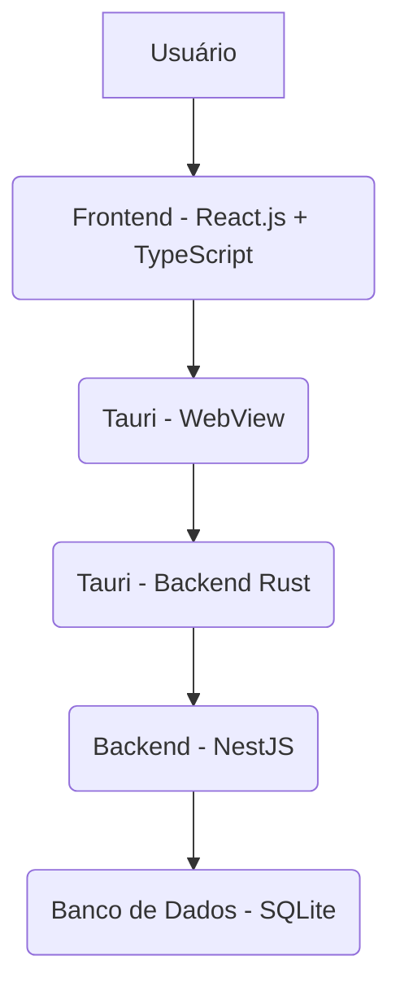

Excelente escolha de tecnologias! A combinação de Tauri, React.js (TypeScript), NestJS e SQLite é robusta e ideal para um desktop app offline-first como o OriFin.

Aqui está o documento de tecnologias para o projeto OriFin:

---

# Documento de Stack de Tecnologias - OriFin

## 1. Introdução

Este documento descreve a stack de tecnologias selecionada para o desenvolvimento do sistema de gestão de finanças pessoais OriFin. A escolha visa construir uma aplicação desktop performática, segura e com capacidade de operar offline, utilizando ferramentas modernas e eficientes.

## 2. Visão Geral da Arquitetura

O OriFin será desenvolvido como um **Desktop App** utilizando **Tauri**, que permitirá empacotar uma aplicação web (Frontend) e um backend nativo.

- **Frontend:** Desenvolvido com **React.js** e **TypeScript**, responsável pela interface do usuário.
- **Backend:** Desenvolvido com **NestJS**, servindo como a camada de lógica de negócios e acesso a dados.
- **Banco de Dados:** **SQLite**, um banco de dados leve e embarcado, ideal para aplicações desktop offline.

## 3. Detalhamento das Tecnologias

### 3.1. Framework de Aplicação Desktop: Tauri

- **Descrição:** Tauri é um framework para construir binários multi-plataforma para todas as principais plataformas desktop. Ele permite que desenvolvedores usem qualquer framework de frontend que compile para HTML, CSS e JavaScript para criar a interface do usuário, enquanto o backend é construído em Rust.
- **Motivação da Escolha:**
  - **Leveza e Performance:** Gera binários menores e mais performáticos em comparação com alternativas como Electron, devido ao uso de webviews nativas e Rust.
  - **Segurança:** Foco em segurança desde o design, com um modelo de permissões granular.
  - **Multi-plataforma:** Suporte para Windows, macOS e Linux a partir de uma única base de código.
  - **Integração Nativa:** Permite acesso a APIs do sistema operacional, essencial para um aplicativo desktop.
  - **Backend em Rust:** Oferece a possibilidade de escrever lógica de backend de alta performance e segura em Rust, que pode interagir diretamente com o NestJS ou atuar como uma camada de comunicação.

### 3.2. Frontend: React.js com TypeScript

- **Descrição:** React.js é uma biblioteca JavaScript declarativa, eficiente e flexível para a construção de interfaces de usuário. TypeScript é um superconjunto de JavaScript que adiciona tipagem estática.
- **Motivação da Escolha:**
  - **Produtividade:** Componentização e reatividade do React aceleram o desenvolvimento da UI.
  - **Manutenibilidade:** TypeScript melhora a qualidade do código, facilita a detecção de erros em tempo de desenvolvimento e melhora a manutenibilidade de grandes bases de código.
  - **Ecossistema Rico:** Vasta comunidade, bibliotecas e ferramentas disponíveis.
  - **Experiência do Usuário:** Permite criar interfaces de usuário ricas e interativas.

### 3.3. Backend: NestJS

- **Descrição:** NestJS é um framework progressivo de Node.js para a construção de aplicações server-side eficientes, escaláveis e confiáveis. Ele é construído com TypeScript e combina elementos de OOP (Programação Orientada a Objetos), FP (Programação Funcional) e FRP (Programação Reativa Funcional).
- **Motivação da Escolha:**
  - **Arquitetura Modular:** Facilita a organização do código em módulos, controladores e serviços, promovendo a manutenibilidade e escalabilidade.
  - **TypeScript Nativo:** Total compatibilidade e aproveitamento dos benefícios do TypeScript.
  - **Padrões de Projeto:** Implementa padrões como injeção de dependência e arquitetura em camadas, o que é excelente para projetos de médio a grande porte.
  - **Ecossistema Node.js:** Acesso a uma vasta gama de pacotes npm.
  - **API RESTful:** Ideal para construir a camada de API que o frontend consumirá, mesmo que localmente.

### 3.4. Banco de Dados: SQLite

- **Descrição:** SQLite é um sistema de gerenciamento de banco de dados relacional que não requer um processo de servidor separado. Ele é um banco de dados transacional, self-contained, de zero-configuração, que armazena todos os dados em um único arquivo no disco.
- **Motivação da Escolha:**
  - **Offline-First:** Não requer conexão com a internet ou um servidor de banco de dados externo, sendo perfeito para uma aplicação desktop.
  - **Zero-Configuração:** Extremamente fácil de configurar e usar, sem a necessidade de instalação ou gerenciamento complexo.
  - **Leveza:** Ocupa pouca memória e espaço em disco.
  - **Confiabilidade:** Robusto e amplamente testado, utilizado em milhões de aplicações.
  - **Acesso Direto:** O NestJS pode interagir diretamente com o arquivo SQLite, armazenando os dados do usuário localmente.

## 4. Ferramentas de Desenvolvimento e Outras Considerações

- **Gerenciador de Pacotes:** `npm` ou `yarn`
- **Controle de Versão:** Git
- **IDE:** Visual Studio Code (com extensões para React, TypeScript, NestJS, Rust)
- **Testes:** Jest (para backend e frontend), React Testing Library (para frontend)
- **Linter/Formatter:** ESLint, Prettier

## 5. Fluxo de Comunicação (Frontend <-> Backend)

O frontend (React.js) se comunicará com o backend (NestJS) através de chamadas HTTP (RESTful API), mesmo que ambos estejam rodando localmente na máquina do usuário. O Tauri atuará como o empacotador e fornecerá o ambiente de execução para ambos. O backend NestJS, por sua vez, acessará o banco de dados SQLite para persistir e recuperar os dados.

---
